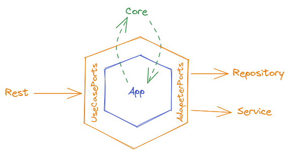

# q2pay-backend-test

## Estrutura

Foi utilizado uma arquitetura hexagonal para o projeto.

Separando-a nos seguintes pacotes:
- Core: núcleo que implementa a regra de negócio
- Rest: lado esquerdo do hexágono (controlador) que implementa o servidor rest que recebe as requisições HTTP
- Repository: lado direito do hexágono (controlado) que implementa as funções do banco de dados
- Service: lado direito do hexágono (controlado) que implementa as funções externas necessárias, nesse projeto temos que chamar um servidor para autorizar transações financeiras
- App: serve como código cola e controle de fluxo, nele que implementamos as chamadas utilizadas (use cases) pelo lado esquerdo e nele que usamos as chamadas do lado direito



Essa arquitetura foi utilizada com testes unitários em mente.
Podendo separar o núcleo de suas dependências, tendo como exemplo banco de dados, servidor REST e serviços de autorização,
fica simples implementar testes unitários ao projeto, pois a regra de negócio se torna desacoplada das dependências que importam.

Além disso, facilita também na hora de escrever testes de integração, bastando
criar implementações mockadas das dependências do núcleo e utilizá-los para
testar as chamadas implementadas pelo App.

### Estrutura das pastas
```
.
└── src -> código-fonte
    ├── adapter -> implementações das ports
    │   ├── repository -> implementação do repositório
    │   ├── rest -> implementação do servidor REST
    │   └── service -> implementação do service
    ├── app -> implementação dos use cases (código cola)
    ├── core -> implementação das regras de negócio
    └── port -> definições das interfaces para as ports
```

## Como rodar o projeto

### Diretamente da linha de comando

Criar um arquivo .env utilizando o exemplo (.env.example) como base, inicializar um server Postgres e depois rodar:

```
% go run src/main.go --migrate
% go run src/main.go
```

### Utilizando Docker

O projeto possui um docker-compose preparado para rodar o projeto bastando apenas criar o .env e executar:

```
% docker compose up
```

Em ambos os casos, um servidor na porta 8080 irá inicializar.

## Documentação das rotas

Pode-se encontrar um arquivo chamado swagger.yaml na raiz do projeto. Nele está a doc do REST utilizando Open Api 3.0.